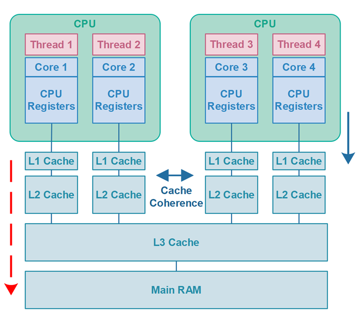

# 싱글톤 패턴 (Sington Patttern)

- 하나의 클래스에 오직 하나의 인스턴스만 가지는 패턴
- 데이터베이스 연결 모듈 등에 많이 사용된다.
- 장점
    - 인스턴스 생성 비용이 줄어든다.
- 단점
    - 싱글톤 객체애 대한 의존성이 높아진다.
    - 코드를 테스트하기 어려워진다.

> **스프링 컨테이너 (Spring Container)**
> 스프링에서 등장하는 스프링 컨테이너 또한 싱글톤 패턴을 적용한 예시이다. 스프링 환경에서는 스프링이 객체들의 생명 주기를 관리하는데, 이때 스프링 컨테이너라는 것을 사용한다. 스프링 컨테이너란 자바 객체를 관리하는 공간을 말하며, 이때 객체들은 싱글톤 객체로 관리된다. 그래서 스프링 컨테이너를 싱글톤 컨테이너라고도 한다.

## 예시

### 고전적인 싱글톤 패턴

아래 구현 코드는 고전적인 싱글톤 패턴 구현 코드이다. 그러나 아래 코드는 멀티 스레드 환경에서 하나의 인스턴스만 생성됨을 보장할 수 없다.

```java
public class Singleton {
    // 싱글턴 인스턴스를 저장하기 위한 필드는 정적으로 선언되어야 합니다.
    private static Singleton instance;
    
    // 싱글턴의 생성자는 `new` 연산자를 사용한 직접 생성 호출들을 방지하기 위해
    // 항상 비공개여야 합니다.
    private Singleton() {}
    
    // 싱글턴 인스턴스로의 접근을 제어하는 정적 메서드.
    public static Singleton getInstance() {
        // 멀티 스레드 환경의 경우 여기에 추가적인 작업이 필요합니다.
        if (instance == null) {
            instance = new Singleton();
        }
        return instance;
    }
    ...
}
```

여러 스레드가 동시에 `getInstance()` 를 접근한다고 가정해 보자. 위 코드를 보면 인스턴스를 생성하는 연산은 모두 비 원자적 연산임을 알 수 있다.

### DCL(Double-Checked Locking)

이중 확인 잠금(DCL)이란 말 그대로 인스턴스 생성 여부를 2번 확인하는 방식이다. `volatile` 키워드를 사용함으로써 멀티 스레드 환경에서 항상 변수의 최신 값을 읽어옴을 보장한다.

```java
public class Singleton {
 
    private volatile static Singleton instance;
    
    private Singleton() {}
    
    public static Singleton getInstance() {
        if (instance == null) {
            synchronized(Singleton.class) {
                if (instance == null) {
                    instance = new Singleton();
                }
            }
        }
        return instance;
    }
}
```

### volatile

`volatile` 키워드 변수가 자바의 main memory에 저장됨을 명시하는 키워드이다.

본래 각 스레드는 메인 메모리로부터 값을 복사해 CPU cache에 저장하여 작업한다. 이후 값을 읽어올 때 우선 캐시에 해당 값이 있는지 확인하고 없는 경우에만 메인 메모리에서 읽어온다.

그러다보니 도중에 메모리에 저장된 변수의 값이 변경되었는데도 캐시에 저장된 값이 갱신되지 않아 메모리에 저장된 값과 달라지는 경우가 발생하게 된다.



이런 상황에서 `volatile`을 사용하면 각 스레드에서 사용되는 값을 CPU cache가 아닌 main memory에서 read & write 함을 보장할 수 있다. 즉 `volatile` 키워드는 main memory에 저장하고 읽게끔 하여 변수 값 불일치 문제를 해결한다.


## 의존성 (Dependency)

- 코드에서 두 모듈(클래스)간의 연결 혹은 관계
    - 클래스 A가 클래스 B를 이용 → A가 B에 의존한다.
    - 의존 대상 B가 변하면, A에 영향을 미치는 관계이다.
- 의존성을 지양해야 하는 이유
    - 모듈의 재사용성을 감소시킨다.
    - 테스트 작성을 어렵게 만든다.
    - 다른 모듈의 변경을 야기한다.

### 의존성 주입 (Dependency Injection)

객체가 의존하는 또 다른 객체를 외부에서 선언하고, 이를 주입하는 것

- 장점
    - 의존성이 줄어든다. 
    - 재사용성을 높일 수 있다. (확장성, 유지보수성 증가)
    - 테스트하기 좋아진다.
- 단점
    - 복잡성 증가 (책임 분리로 인한 클래스 증가, 코드 추적의 어려움)
    - 개발 비용 증가

> **IoC (제어의 역전; Inversion of Control)**
> - 프로그램의 실행 흐름(제어권)을 개발자가 아닌 외부에서 제어하는 것
> - 애플리케이션의 의존성 제거 및 느슨한 결합을 목적으로 사용한다.

### 의존성 주입 원칙 (DIP)
- "상위 모듈은 하위 모듈에서 어떤 것도 가져오지 않아야 한다."
- 두 모듈 모두 추상화에 의존해야 하며, 추상화는 세부 사항에 의존하지 말아야 한다.