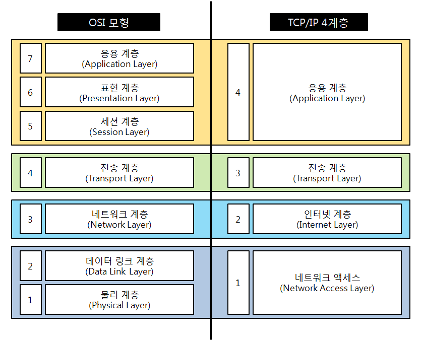

# TCP/ IP 4계층 모델

**인터넷 프로토콜 스위트(영어: Internet Protocol Suite)**
- 인터넷 상에서 컴퓨터들이 정보를 주고 받는데 사용되는 프로토콜의 집합
- 이중 TCP와 IP가 가장 많이 쓰이기 때문에 **TCP/IP 프로토콜 스위트**라고도 불린다.
- TCP/IP 4계층 모델이나 OSI 7계층 모델로 설명하기도 한다.

> **TCP/IP 모델**: 프로토콜의 네트워킹 범위에 따라 4개의 추상화 계층으로 구성된 모델
> **OSI 모델**: 프로토콜의 네트워킹 범위에 따라 7개의 추상화 계층으로 구성된 모델

<figure>
    
    <figcaption>출처: https://velog.io/@ssulv3030/%EB%84%A4%ED%8A%B8%EC%9B%8C%ED%81%AC-TCPIP-4%EA%B3%84%EC%B8%B5</figcaption>
</figure>

## **TCP/IP vs. OSI**

**공통점**
- 두 모델 모두 데이터 통신을 표현한 모델이다.
- 각 계층들은 다른 계층에 영향을 받지 않도록 유연하게 설계되어 있다.

**차이점**
- OSI: 데이터 통신에 필요한 계층과 역할을 정확하게 정의하려고 한 모델
- TCP/IP: 좀 더 실무적이면서 프로토콜 중심으로 단순화된 모델

## 애플리케이션 계층

웹 서비스, 이메일 등 사람들에게 서비스를 실질적으로 제공하는 계층
- FTP: 장치 간 파일 전송에 사용되는 프로토콜
- SSH: 보안되지 않는 네트워크에서 안전한 서비스 이용을 위해 사용되는 암호화 네트워크 프로토콜
- HTTP: WWW을 위한 데이터 통신의 기초이, 웹사이트를 이용하는 데에 사용되는 프로토콜
- SMTP: 전자 메일 전송을 위해 사용되는 프로토콜
- DNS
    - 도메인명을 IP 주소로 변환해주는 시스템 혹은 표준 프로토콜
    - DNS에는 도메인명과 IP 주소가 서로 매핑되어 저장되어 있다.
    - 사용자가 특정 도메인을 입력하면, 그에 매치되는 IP 주소를 찾아서 변환해준다.

## 전송 계층

- 송신자와 수신자를 연결하는 통신서비스를 제공하는 계층이다.
- 연결 지향 데이터 스트림, 신뢰성, 흐름 제어 등을 제공
- e.g. TCP, UDP

### TCP vs. UDP

**TCP**
- 연결형 서비스: 연결을 설정하고 해제하는 과정 존재 O
    - 가상 회선 패킷 교환 방식: 발신지와 수신지를 연결, 패킷 전송을 위한 논리적 경로 배정
    - 3-way handshaking으로 연결 설정, 4-way handshaking으로 연결 해제
- 혼잡 제어: 네트워크 내의 패킷 수가 과도하게 증가하지 않도록 방지
- 신뢰성 있는 전송이 중요할 때 사용된다.

**UDP**
- 비연결형 서비스: 연결을 설정하고 해제하는 과정 존재 X
    - 데이터그램 패킷 교환 방식: 패킷 전송을 위한 논리적 경로 없이 각 패킷이 독립적 관계를 지님
    - TCP의 3-way handshaking과 같은 과정 X
- 흐름 제어가 없기 때문에 제대로 전송되었는지, 오류가 없는지 확인할 수 없음
- 단, 별도이 설정 과정이 없기 때문에 상대적으로 속도가 빠름
- 주식, 게임 거래 등 신뢰성보다 연속성이 중요한 통신인 경우에 주로 사용됨

**정리**
TCP는 신뢰성을 보장하는 연결 지향 프로토콜입니다. 통신 전후로 3way, 4way 핸드쉐이크 과정을 수립하며 패킷 전송을 위한 논리적인 경로를 설정하여 패킷 전송 순서를 보장하며, 데이터 흐름 제어나 혼잡 제어 기능을 통해 신뢰성 있는 데이터 통신을 제공합니다. 그래서 TCP는 파일 전송과 같이 연속성보다 신뢰성 있는 전송이 중요할 때 사용됩니다.

UDP는 반대로 신뢰성보다 연속성을 보장하는 프로토콜로, TCP와 같이 별도의 통신 경로를 수립하는 과정이 없으며, 기본적으로 TCP와 같은 검증 기능을 제공하지 않기 때문에 상대적으로 신뢰성이 낮고 데이터 전송 순서 또한 보장되지 않습니다. 다만 이런 설정을 거치지 않아 상대적으로 속도가 빠르다는 특징 때문에, 주식이나 게임 거래 등 신뢰성보다 연속성이 중요한 통신인 경우에 주로 사용됩니다.

#### 3-way handshake 과정

1. `SYN`: 클라이언트는 서버에 클라이언트의 ISN을 담아 SYN을 보냄
2. `SYN + ACK`: 서버는 클라이언트의 SYN을 수신하고, 서버의 ISN와 함께 승인번호로 `클라이언트 ISN + 1`번을 보냄
3. `ACK`: 클라이언트는 승인번호로 `서버의 ISN + 1`한 값을 담아 ACK를 서버에 보냄

#### 4-way handshake 과정

1. 클라이언트 연결 종료 시 FIN으로 설정된 세그먼트 전송, 클라이언트는 `FIN_WAIT1` 상태로 전환되어 서버의 응답을 기다림
2. 서버는 클라이언트로 ACK라는 승인 세그먼트 전송, `CLOSE_WAIT` 상태로 전환, 클라이언트가 세그먼트를 받으면 `FIN_WAIT2` 상태로 전환됨
3. 서버는 일정시간 이후에 클라이언트에 FIN이라는 세그먼트 전송
4. 클라이언트는 `TIME_WAIT` 상태가 되고 다시 서버로 ACK 전송, 서버는 `CLOSED`상태로 전환, 클라이언트는 일정시간 대기후 연결이 닫히고 클라이언트와 서버의 모든 자원 연결 해제
    - `TIME_WAIT`: 소켓이 바로 소멸되지 않고 일정 시간 유지되는 상태 (OS 마다 유지 시간 다름)

> **일정시간 대기 후 종료하는 이유 (TIME_WAIT)**
> 1. 지연 패킷 발생 경우를 대비하기 위해
> 2. 두 장치의 연결이 닫혔는지 확인하기 위해
> 
> 위와 같은 이유로 `TIME_WAIT`이라는 잠시 기다릴 시간이 필요한 것

## 인터넷 계층

- 장치로부터 받은 네트워크 패킷을 IP주소로 지정된 목적지로 전송하기 위해 사용되는 계층
- 패킷을 수신해야 할 상대의 주소를 지정하여 데이터를 전달한다.
- 데이터 수신을 보장하지 않는 비연결형적인 특징을 가지고 있다.
- e.g. IP, ARP, ICMP 등

## 링크 계층 (네트워크 접근 계층)

- 실질적으로 데이터를 전달하며 장치 간 신호를 주고받는 규칙을 정하는 계층
- 전선, 광섬유, 무선 등의 매개체 이용
- OSI 계층의 경우 이를 데이터 링크와 물리 계층으로 나누기도 한다.
    - 데이터 링크: '이더넷 프레임'을 통해 에러 확인, 흐름 제어, 접근 제어를 담당하는 계층
    - 물리: 무선/유선 LAN 등을 통해 0과 1로 이루어진 데이터를 보내는 계층

### 유선 LAN 

- IEEE802.3 프로토콜 사용 (전이중화 통신)
- 전이중화 통신(full duplex)
    - 양쪽 장치가 동시에 송수신할 수 있는 방식
    - 송신로와 수신로가 나눠서 데이터를 주고 받음
    - 현대의 고속 이더넷은 이 방식 기반으로 통신함
- 전이중화 통신 이전에는 CSMA/CD라는 반 이중화 통신 방식을 이용
    - CSMA/CD: 데이터를 보낸 이후 충돌 발생 시 일정 시간 후 재전송하는 방식

### 무선 LAN

- 수신과 송신에 같은 채널 사용 -> 반이중화 통신 이용
- 반이중화 통신(half duplex)
    - 양쪽 장치가 서로 통신이 가능하지만, 한 번에 한 방향만 통신할 수 있는 방식
    - 한쪽 장치에서 신호를 수신하기 시작하면 전송이 완료될 때까지 기다려야 함
    - 둘 이상의 장치가 동시에 전송 시 충돌이 발생하여 메시지가 충돌 또는 왜곡될 수 있음 -> 충돌 방지 시스템 필요

### 와이파이

- 전자기기들이 무선 LAN 신호에 연결할 수 있게 하는 기술
- 이를 사용하려면 공유기와 같은 무선 접속 장치(Access Point; AP)가 있어야 함
- AP를 통해 유선 LAN에 흐르는 신호를 무선 LAN 신호로 바꿔주어 신호가 닿는 범위 내에서 무선 인터넷을 사용할 수 있게 된다.
- 무선 LAN을 사용하는 기술로는 지그비, 블루투스 등도 있다.

> **MAC 주소**
> 네트워크 연결 장치를 식별하는 번호, 6바이트로 구성된다.

## 계층 간 데이터 송수신 과정

HTTP를 통해 웹 서버에 있는 데이터를 요청하는 경우:

1. 애플리케이션 계층에서 전송 계층으로 보내는 요청 값들이 **캡술화 과정**을 거쳐 전달된다.
2. 링크 계층을 통해 해당 서버와 통신한다.
3. 해당 서버의 링크 계층으로부터 애플리케이션까지 **비캡슐화 과정**을 거쳐 데이터가 전송된다.
3. 서버는 요청에 대한 응답 데이터를 만들고, **캡슐화 과정**을 거쳐 클라이언트로 전달된다.
4. 클라이언트는 서버로부터 전송된 데이터에 대한 **비캡슐화 과정**을 거쳐 받아온 데이터를 처리한다.

---

**캡슐화 과정**
상위계층의 헤더와 데이터를 하위계층의 데이터로 포함시키고, 해당 계층의 헤더를 삽입하는 과정

**역캡슐화 과정**
하위계층에서 상위계층으로 가며 각 계층의 헤더 부분을 제거하는 과정

## PDU

- 네트워크의 어떤 계층에서 계층으로 데이터가 전달될 때 한 덩어리의 단위
- 헤더(제어정보관련)와 페이로드(데이터)로 구성, 각 계층마다 부르는 명칭이 다르다.

| 계층명 | PDU |
| :---: | :---: |
| 애플리케이션 | 메시지 |
| 전송 | 세그먼트(TCP), 데이터그램(UDP) |
| 인터넷 | 패킷 |
| 링크 | 프레임(데이터링크), 비트(물리) |
