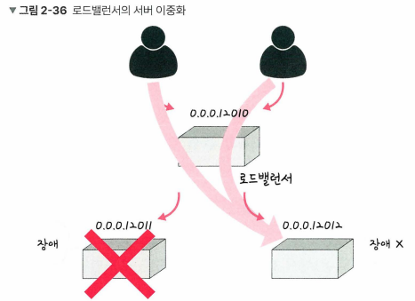

# 네트워크 기기

- 계층별로 처리 범위를 나눌 수 있다.
- 상위 계층을 처리하는 기기는 하위 계층 처리 가능, but 그 반대는 불가

| 계층명 | 네트워크 기기 |
| :---: | :---: |
| 애플리케이션 | L7 스위치 |
| 인터넷 | L3 스위치 |
| 데이터 링크 | L2 스위치, 브리지 |
| 물리 | NIC, 리피터, AP |

## 애플리케이션 계층을 처리하는 기기

### L7 스위치 (로드밸런서)

- 서버의 부하를 분산하는 기기
- 클라이언트로부터 오는 요청을 뒤쪽의 여러 서버로 나누는 역할을 하며, 시스템이 처리할 수 있는 트래픽 증가를 목표로 한다.
- URI, 서버, 캐시, 쿠키 등을 기반으로 트래픽을 분산
- 필터링 기능 (바이러스, 불필요한 외부 데이터 제외) 및 응용 프로그램 수준의 트래픽 모니터링 기능 제공
- 이외에 정기적인 헬스 체크(health check)를 통해 장애가 발생한 서버를 트래픅 분산 대상에서 제외

### L4/L7 스위치

- 로드밸런서로는 L4 스위치도 존재한다.
- L4 스위치는 전송 계층을 처리하는 기기로, IP와 포트를 기반으로 트래픽을 분산하는 장치이다.
- 반면 L7 로드밸런서는 IP, 포트 외에도 URI, HTTP 헤더, 쿠키 등을 기반으로 트래픽을 분산한다.
- AWS와 같은 클라우드 서비스에서 L7 스위치를 활용한 로드밸런싱은 ALB 컴포넌트로 하며, L4 스위치를 활용한 로드밸런싱은 NLB 컴포넌트로 수행한다.

> 스위치란 여러 장비를 연결하고 데이터 통신을 중재하며, 목적지가 연결된 포트로만 전기 신호를 보내 데이터를 전송하는 통신 네트워크 장비이다.

### 헬스 체크

- 정상적인 서버, 또는 비정상적인 서버를 판별하기 위해 사용
- 전송 주기와 재전송 횟수 등을 설정한 이후 반복적으로 서버에 요청을 보내는 것을 말한다.
- 이때 서버에 부하가 되지 않을 만큼 요청 횟수가 적절해야 한다.

### 로드 밸런서를 이용한 서버 이중화

로드 밸런서는 2대 이상의 서버를 기반으로 가상 IP를 제공하고, 이를 기반으로 안정적인 서비스를 제공할수 있다.

로드밸런서가 제공한 `0.0.0.12010`이란 가상 IP에 사용자들이 접근하고, 뒷단에 사용 가능한 서버인 `0.0.0.12011`과 `0.0.0.12012`를 기반으로 운영한다. 이렇게 하면 한쪽 서버에 장애가 발생해도, 다른 쪽 서버를 기반으로 안정적인 서비스를 운용할 수 있다.

## 인터넷 계층을 처리하는 기기

### 라우터

- 네트워크 간의 경로를 설정하고 가장 빠른 길로 트래픽을 이끌어주는 장치
- 여러 개의 네트워크를 연결, 분할, 구분해주는 역할을 수행한다.
- 패킷 소모를 최소화하고, 경로를 최적화하여 최소 경로로 패킷을 포워딩(forwarding)하는 라우팅하는 장비이다.

> 포워딩이란 패킷을 목적지로 가는 경로 상에 올려놓는 것을 의미한다. 즉, 라우터는 패킷 소모를 최소화하고 최적화된 경로로 패킷을 다음 목적지로 올려두는 라우팅 장치라고 할 수 있다.

### L3 스위치

- L2 스위치의 기능과 라우팅 기능을 갖춘 장비
- 하드웨어 기반의 라우팅을 담당하는 장치이다.

| 구분 | L2 스위치 | L3 스위치 |
| :--- | :--- | :--- |
| 참조 테이블 | MAC 주소 테이블 | 라우팅 테이블 |
| 참조 PDU | 이더넷 프레임 | IP 패킷 |
| 참조 주소 | MAC 주소 | IP 주소 |

## 데이터 링크 계층을 처리하는 기기

### L2 스위치

- MAC 주소를 기반으로 스위칭을 수행하는 장비
- IP 주소를 이해하지 못해 IP 주소 기반 라우팅은 불가능
- 패킷의 MAC 주소를 읽어 스위칭하는 역할을 수행한다.
- 목적지가 MAC 주소 테이블에 없다면 전체 테이블에 전달하고, MAC 주소 테이블의 주소는 일정 시간 이후 삭제하는 기능도 있다.

> 스위칭이란 데이터(패킷)를 송수신 장치 간에 전달하는 것을 말한다. 패킷이 라우터나 스위치에 도착했을 때, 목적지 주소를 확인하고 어느 포트로 전달할지 결정하는 과정을 의미한다.

### 브리지

- 두 개의 근거리 통신망(LAN)을 상호 접속할 수 있도록 하는 통신망 연결 장치
- 포트와 포트 사이의 다리 역할을 하며, 장치에서 받아온 MAC 주소를 MAC 주소 테이블로 관리한다.
- 주로 통신망 범위를 확장하고, 서로 다른 LAN 등으로 이루어진 '하나의' 통신망을 구축할 때 쓰인다.

## 물리 계층을 처리하는 기기

### NIC (네트워크 인터페이스 카드)

- 네트워크와 빠른 데이터 송수신 사용을 위해 컴퓨터 내에 설치하는 확장 카드이다.
- 각 LAN 카드는 고유의 식별번호인 MAC 주소가 존재한다.

### 리피터

- 들어오는 약해진 신호 정도를 증폭하여 다른 쪽으로 전달하는 장치
- 이를 통해 패킷을 더 멀리 보낼 수 있지만, 광케이블 보급에 따라 현재는 잘 쓰이지 않는 장치이다.

### AP (Access Point)

- 패킷을 복사하는 기기
- AP에 유선 LAN을 연결한 후 다른 장치에서 무선 LAN 기술 (와이파이 등)을 사용하여 무선 네트워크 연결을 수행할 수 있다.

> 즉 무선 네트워크 연결을 가능하게 하는 무선 네트워크 중계망으로 이해할 수 있다.

