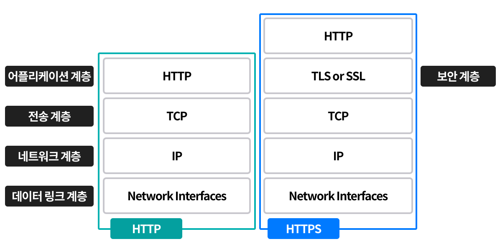

# HTTP

## HTTP/1.0

- 한 연결 당 하나의 요청을 처리하도록 설계된 HTTP 프로토콜
- 서버로부터 파일을 가져올 때마다 3-way 핸드세이크를 계속 열어야 해서 RTT가 증가한다는 단점이 존재

> **RTT**
> 패킷 왕복 시간, 패킷이 목적지에 도달하고 나서 다시 출발지로 돌아오기까지 걸리는 시간

### RTT 증가를 해결하기 위한 방법

- 매번 연결 시마다 RTT 증가 -> 서버에 부담이 많이 가고 사용자 응답 시간이 길어짐
- 이를 해결하기 위해 이미지 스플리팅, 코드 압축, 이미지 base64 인코딩 방식을 사용함

#### 이미지 스플리팅

여러 이미지를 합친 하나의 이미지를 다운받고, 이를 기반으로 `background-image`의 `position`을 이용해 이미지를 표기하는 방법

#### 코드 압축

코드를 압축하여 개행 문자, 빈칸 등을 없애 코드 크기를 최소화하는 방법

#### 이미지 base64 인코딩

이미지 파일을 64진법으로 이루어진 문자열로 인코딩하는 방법

- 장점: 서버에 추가적인 HTTP 요청을 할 필요가 없음
- 단점: 인코딩 시 크기가 더 커짐

> 인코딩이란 표준화, 보안, 속도 향상, 저장 공간 절약 등을 목적으로 다른 형태/형식으로 변환하는 것을 말한다.

## HTTP/1.1

- HTTP/1.0이 발전된 형태
- 매번 TCP 연결을 하던 기존 방식과 달리 TCP 초기화 이후 `keep-alive`라는 옵션으로 여러 파일을 송수신할 수 있게 변경되었다.
- 그러나 리소스의 개수에 비례하여 대기 시간이 길어지는 단점이 있다.
    - 무거운 헤더 + 메타 데이터 압축 X

### HOL Blocking

- 네트워크 상에서 발생하는 성능 저하 현상
- 같은 큐에 있는 패킷이 그 큐의 첫 번째 패킷에 의해 지연될 때 전체 성능이 저하되는 현상을 말한다. 

## HTTP/2

- HTTP/1.x 버전의 개선된 형태
- 지연 시간을 줄이고 응답 시간을 더 빠르게 개선하였다.
- 멀티플렉싱, 헤더압축, 서버 푸시, 요청 우선순위 처리 등의 기능을 지원한다.

### 멀티플렉싱

- 여러 개의 스트림을 이용해 송수신 하는 방식
- 특정 스트림의 패킷이 분실되어도 나머지 스트림은 정상 동작할 수 있다.
- HTTP/2는 멀티플렉싱을 통해 병령 요청 및 응답이 가능하기 때문에 HOL Blocking과 같은 문제를 해결할 수 있다.

> 스트림(stream)이란 데이터 흐름 상에서 시간이 지남에 따라 사용할 수 있는 데이터 요소를 말한다.

### 헤더 압축

- HTTP/2.0에서는 'HPACK'이라는 허프만 코딩 압축 알고리즘 기술을 이용하여 헤더 압축을 지원한다.
- 이를 통해 기존 1.x번대의 단점이었던 뚱뚱한 헤더 문제를 해결할 수 있다.

> 허프만 코딩(Huffman coding)
> 압축 알고리즘 기술 중 하나로, 전체 데이터에 대해 필요한 비트양을 줄임으로써 데이터를 압축하는 기술입니다. 문자열을 문자 단위로 쪼개고, 빈도수를 세어 빈도가 높은 정보는 적은 비트 수로 표현하고, 빈도가 낮은 정보는 비트 수를 많이 표현함으로써 비트 양을 줄이는 원리로 동작합니다.

### 서버 푸시

- 클라이언트의 요청 없이 서버가 바로 리소스를 푸시할 수 있는 기술
- HTML 파일을 읽으면서 그 안에 있던 CSS 파일을 서버에서 푸시하여 클라이언트에 먼저 전달 가능

## HTTPS

- 신뢰성을 보장한 HTTP/2 프로토콜
- 애플리케이션 계층과 전송 계층 사이에 SSL/TLS 계층을 넣음으로써 통신을 암호화한다.

> **SSL/TLS**
> 전송 계층에서 보안을 제공하는 프로토콜이다.
> 클라이언트-서버 간의 통신에서 제 3자가 메시지를 도청하거나 변조하는 것을 방지한다.
> SSL/TLS는 보안 세션을 기반으로 데이터를 암호하하며, 보안 세션 생성 시 인증 매커니즘, 키 교환 알고리즘, 해싱 알고리즘 등이 사용된다.
>
> **보안 세션**
> 보안이 시작되고 끝나는 동안 유지되는 세션을 칭하며, SSL/TLS는 헨드셰이크를 통해 보안 세션을 생성하고 이를 기반으로 상태 정보 등을 공유한다.

**TLS 핸드셰이크 과정**
- 클라이언트에서 '사이퍼 슈트(cypher suite)'를 서버에 전달한다.
- 서버는 사이퍼 슈트의 암호화 알고리즘 리스트를 제공할 수 있는 확인한다.
- 제공할 수 있는 경우, 서버에서 클라이언트로 인증서를 보내는 인증 매커니즘이 시작되고, 이후 해싱 알고리즘 등으로 암호화된 데이터의 송수신이 시작된다.

> 사이퍼 슈트란 프로토콜, 해싱 알고리즘이 나열된 규약을 말하며, 총 5개가 존재한다.

